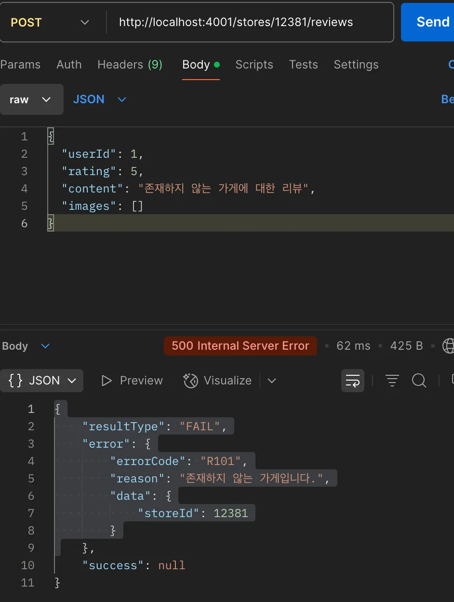

# 컨트롤로 계층에서 응답 통일
```
// store.controller.js
export const handleAddStore = async (req, res, next) => {
  try {
    const locationId = parseInt(req.params.locationId);
    const store = await addStore(locationId, bodyToStore(req.body));
    res.status(StatusCodes.OK).success(store); // 상태  응답 통일
  } catch (err) {
    next(err);
  }
};

export const handleListStoreMissions = async (req, res, next) => {
  try {
    const storeId = parseInt(req.params.storeId);
    const missions = await listStoreMissions(storeId);
    res.status(StatusCodes.OK).success(missions); // 상태 응답 통일
  } catch (err) {
    next(err);
  }
};

export const handleListStoreReviews = async (req, res, next) => {
  try {
    const storeId = parseInt(req.params.storeId);
    const cursor = typeof req.query.cursor === "string" ? parseInt(req.query.cursor) : 0;
    const reviews = await listStoreReviews(storeId, cursor);
    res.status(StatusCodes.OK).success(reviews); // 상태 응답 통일
  } catch (err) {
    next(err);
  }
};
```
# 서비스 계층에서 오류 처리 커스텀, Error 핸들링
```
// store.service.js
import { responseFromStore } from "../dto/store.dto.js";
import { getLocationById, saveStore, getStoreById, getAllStoreReviews } from "../repositories/store.repository.js";
import { responseFromReviews } from "../dto/review.dto.js";
import { LocationNotFoundError, StoreNotFoundError } from "../errors.js";

export const addStore = async (locationId, data) => {
  const location = await getLocationById(locationId);
  if (!location) {
    throw new LocationNotFoundError("존재하지 않는 지역입니다.", { locationId });
  }

  const storeId = await saveStore(locationId, data);
  const store = await getStoreById(storeId);

  if (!store) {
    throw new StoreNotFoundError("저장된 가게를 다시 불러오는 데 실패했습니다.", { storeId });
  }

  return responseFromStore(store);
};

export const listStoreReviews = async (storeId, cursor = 0) => {
  const store = await getStoreById(storeId);
  if (!store) {
    throw new StoreNotFoundError("존재하지 않는 가게입니다.", { storeId });
  }
  const reviews = await getAllStoreReviews(storeId, cursor);
  return responseFromReviews(reviews);
};

```
# error.js
```
// errors.js
export class DuplicateUserEmailError extends Error {
  errorCode = "U001";

  constructor(reason, data) {
    super(reason);
    this.reason = reason;
    this.data = data;
  }
}

//Read
export class StoreNotFoundError extends Error {
  errorCode = "R101";
  constructor(reason = "존재하지 않는 가게입니다.", data) {
    super(reason);
    this.reason = reason;
    this.data = data;
  }
}

export class LocationNotFoundError extends Error {
  errorCode = "R102";
  constructor(reason = "존재하지 않는 지역입니다.", data) {
    super(reason);
    this.reason = reason;
    this.data = data;
  }
}
export class MissionNotFoundError extends Error {
  errorCode = "R103";
  constructor(reason = "존재하지 않는 미션입니다.", data) {
    super(reason);
    this.reason = reason;
    this.data = data;
  }
}

export class ReviewNotFoundError extends Error {
  errorCode = "R104";
  constructor(reason = "존재하지 않는 리뷰입니다.", data) {
    super(reason);
    this.reason = reason;
    this.data = data;
  }
}

// InValid
export class MissingParameterError extends Error {
  errorCode = "V001";
  constructor(reason = "필수 입력값이 누락되었습니다.", data) {
    super(reason);
    this.reason = reason;
    this.data = data;
  }
}
export class InvalidParameterError extends Error {
  errorCode = "V002";
  constructor(reason = "입력값이 올바르지 않습니다.", data) {
    super(reason);
    this.reason = reason;
    this.data = data;
  }
}
// S, Server
export class InternalServerError extends Error {
  errorCode = "S001";
  constructor(reason = "Unexpected server error", data = null) {
    super(reason);
    this.reason = reason;
    this.data = data;
  }
}

export class DatabaseError extends Error {
  errorCode = "S002";
  constructor(reason = "데이터베이스 오류 발생", data = null) {
    super(reason);
    this.reason = reason;
    this.data = data;
  }
}
```



