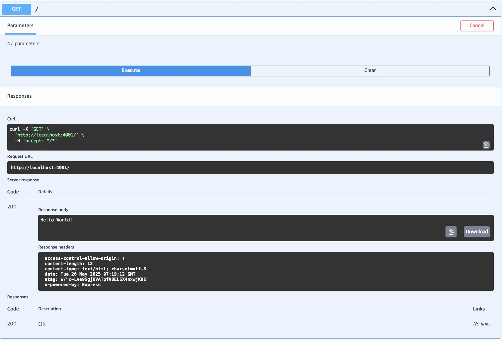
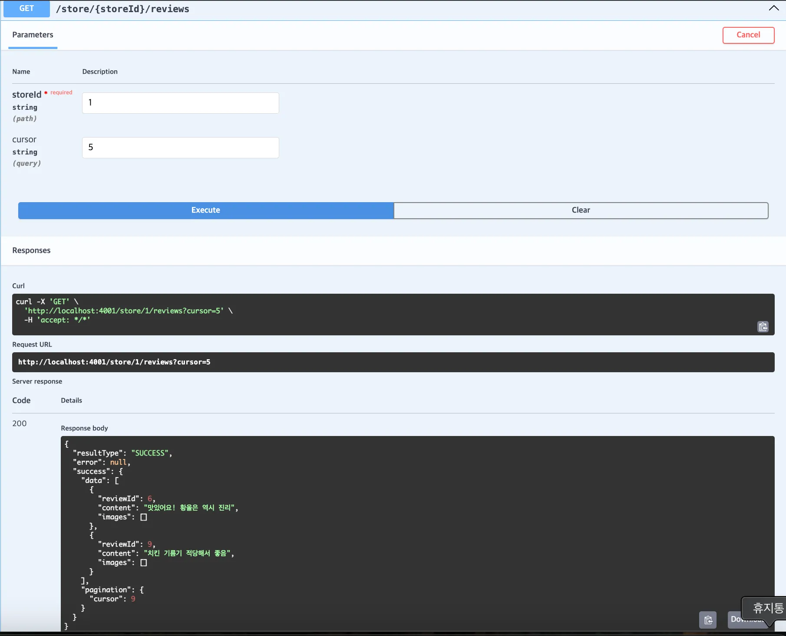
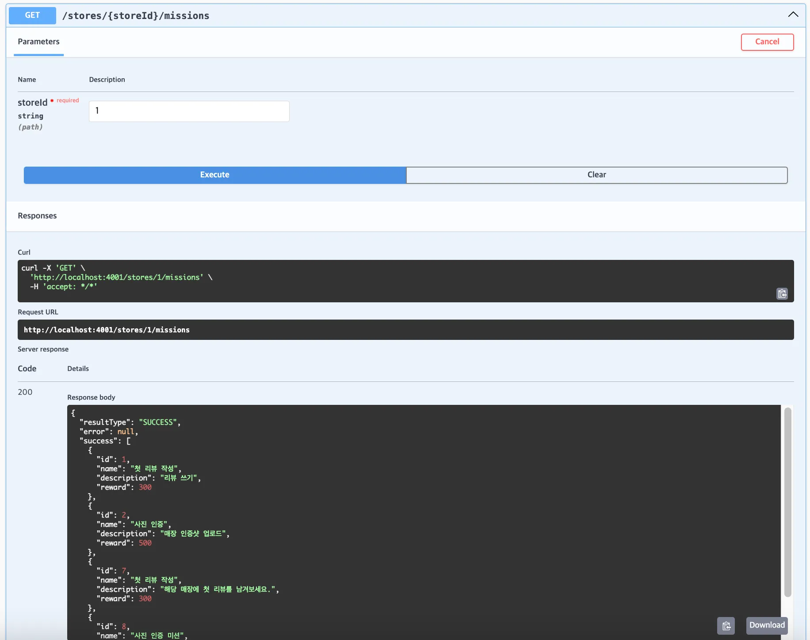
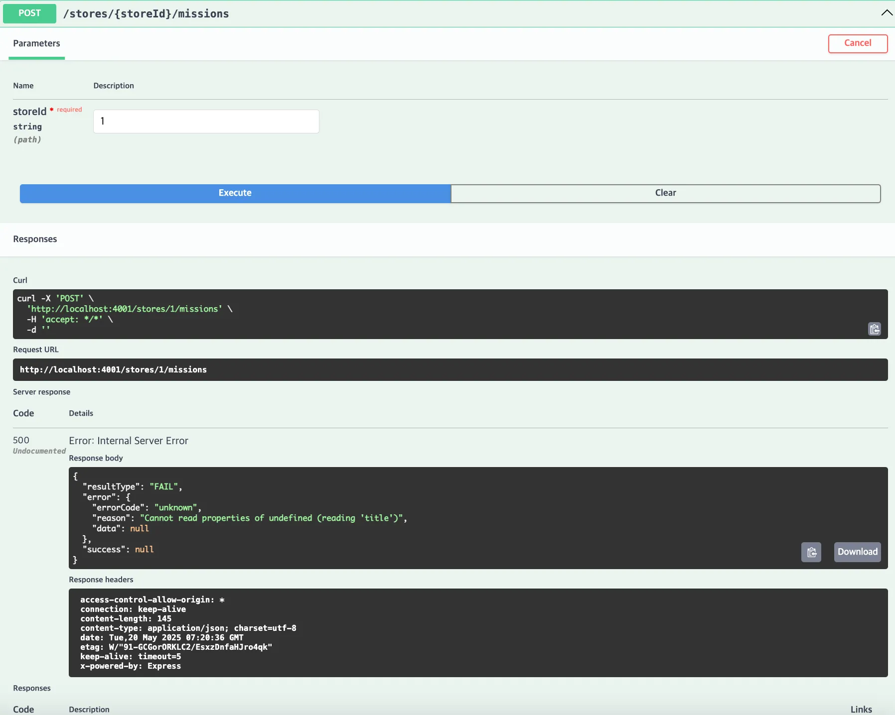
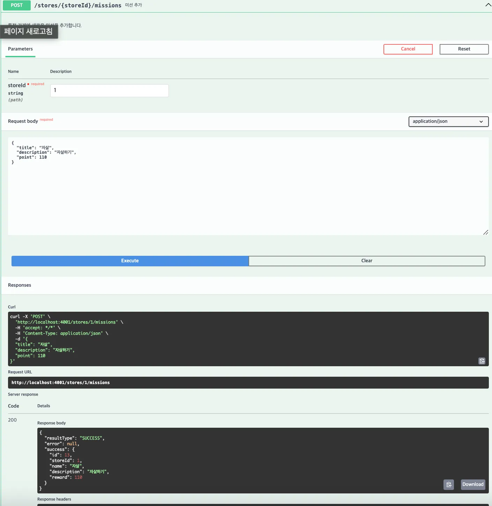

```
// swagger-autogen 기준으로는 함수 밖에 주석이 있으면 POST, 
// requestBody, parameters 제대로 작동안함
export const handleAddStore = async (req, res, next) => {
  // #swagger.tags = ['Stores']
  // #swagger.summary = '가게 등록'
  // #swagger.description = '지역 ID에 새로운 가게를 등록합니다.'
  // #swagger.parameters['locationId'] = {
  //   in: 'path',
  //   description: '지역 ID',
  //   required: true,
  //   type: 'integer'
  // }
  /* #swagger.requestBody = {
        required: true,
        content: {
          "application/json": {
            schema: {
              type: "object",
              properties: {
                name: { type: "string", example: "곰탕의 진수" },
                category: { type: "string", example: "한식" },
                description: { type: "string", example: "진한 국물과 부드러운 고기의 조화" }
              },
              required: ["name", "category", "description"]
            }
          }
        }
    }
  */

  try {
    const locationId = parseInt(req.params.locationId);
    if (isNaN(locationId)) {
      throw new InvalidParameterError("유효하지 않은 locationId입니다.", {
        locationId: req.params.locationId,
      });
    }

    const store = await addStore(locationId, bodyToStore(req.body));
    res.status(StatusCodes.CREATED).success(store);
  } catch (err) {
    next(err);
  }
};

// 가게별 미션 목록 조회
// #swagger.tags = ['Stores']
// #swagger.summary = '가게별 미션 목록 조회'
// #swagger.description = '특정 가게의 등록된 미션들을 조회합니다.'
// #swagger.parameters['storeId'] = { description: '가게 ID', type: 'integer', in: 'path', required: true }
export const handleListStoreMissions = async (req, res, next) => {
  try {
    const storeId = parseInt(req.params.storeId);
    const missions = await listStoreMissions(storeId);
    res.status(StatusCodes.OK).success(missions);
  } catch (err) {
    next(err);
  }
};

// 가게별 리뷰 목록 조회
// #swagger.tags = ['Stores']
// #swagger.summary = '가게 리뷰 목록 조회'
// #swagger.description = '특정 가게의 사용자 리뷰를 조회합니다.'
// #swagger.parameters['storeId'] = { description: '가게 ID', type: 'integer', in: 'path', required: true }
// #swagger.parameters['cursor'] = { description: '페이지 커서', type: 'integer', in: 'query', required: false }
export const handleListStoreReviews = async (req, res, next) => {
  try {
    const storeId = parseInt(req.params.storeId);
    const cursor = typeof req.query.cursor === "string" ? parseInt(req.query.cursor) : 0;
    const reviews = await listStoreReviews(storeId, cursor);
    res.status(StatusCodes.OK).success(reviews);
  } catch (err) {
    next(err);
  }
};
```




